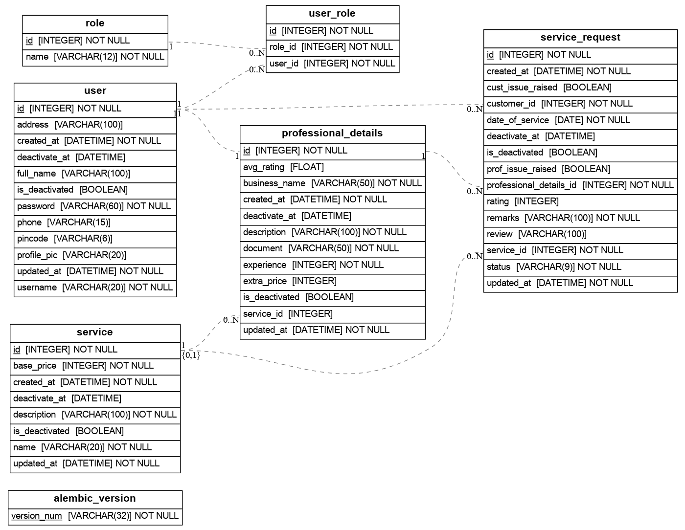

# Household Services Application

## Overview

This project is a multi-user platform for booking home services, where customers can find professionals, book services, and manage requests. Professionals list services, accept bookings, and manage details, while admins oversee the platform, approve providers, and resolve issues. It is developed using Flask and its libraries.

## Demo Video

## Frameworks & Libraries

- **Flask**: Main web framework for handling routes and views.
- **Jinja**: For templating.
- **Sqlite 3**: For the database.
- **Flask-SQLAlchemy**: ORM for database interaction.
- **Flask-Login**: For user session management and authentication.
- **Flask-WTF** and **Email-validator**: For form handling with CSRF protection.
- **Flask-Restful**: For creating REST API endpoints.
- **Plotly**: For visualizing data (summary statistics).

## Approach

The application has three roles: customers, professionals, and admins. Customers can search, book services, and leave reviews. Professionals can manage their service offerings and accept/reject bookings. Admins approve professionals, create/edit services, and address issues raised by users.

Service requests have five statuses: Pending, Accepted, Rejected, Cancelled, and Completed. Professionals can also book services as customers. Deactivated users cannot log in, but deactivated professionals can close pending requests without receiving new ones. Deactivating a service also deactivates its professionals.

## ER Diagram

## Constraints, Validations, and Relations

- **ServiceRequest.Rating**: Must be between 1 and 5 (Enforced by CheckConstraint).
- **Role.name**: Restricted to a set of valid values (`admin`, `customer`, `professional`).
- **ServiceRequest.status**: Restricted to a set of valid values (`Pending`, `Accepted`, `Rejected`, `Completed`, `Cancelled`).
- **User.password**: Validation to have a length between 5 to 20 characters, and it must include at least one digit, one uppercase, and one lowercase character.
- **User.username**: Validation to have a length of 5 to 20 characters.

### Relationships

- **One-to-One**: `User` to `ProfessionalDetails`.
- **One-to-Many**: `Service` to `ProfessionalDetails`, `ProfessionalDetails` to `ServiceRequest`, `User` to `ServiceRequest`.
- **Many-to-Many**: `User` to `Role` (A single user can have multiple roles, e.g., a professional can also act as a customer).

## Features

- Customers can search for services, book them, and leave reviews.
- Professionals can list services, accept/reject bookings, and manage their profile.
- Admins can approve professionals, manage services, and resolve issues.
- Deactivation of users and services, preventing further bookings.

